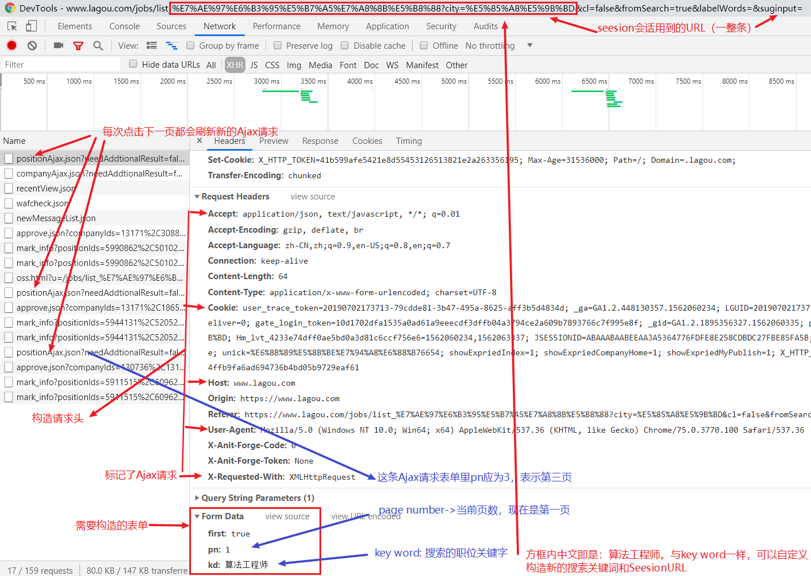
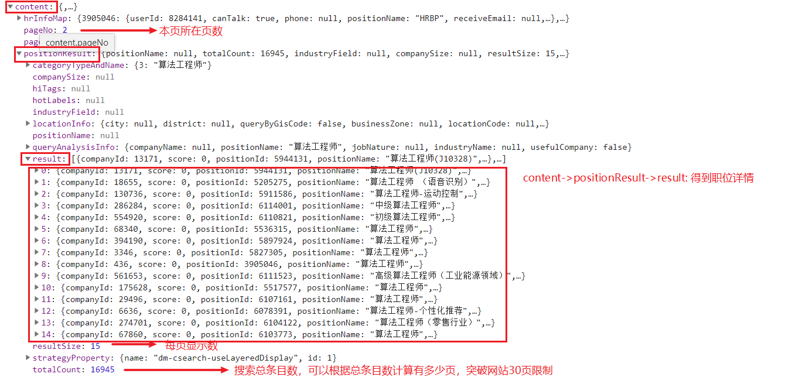
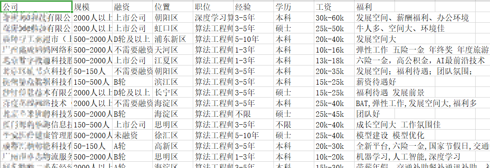
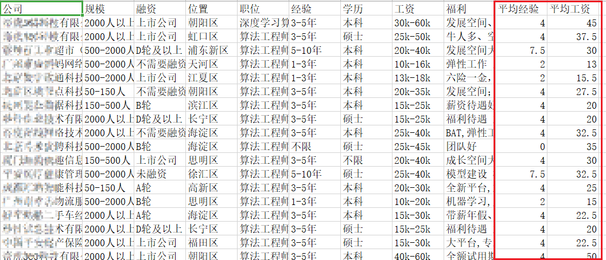
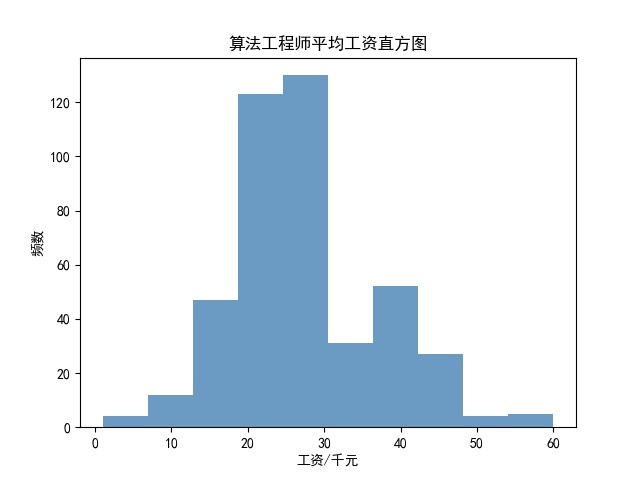
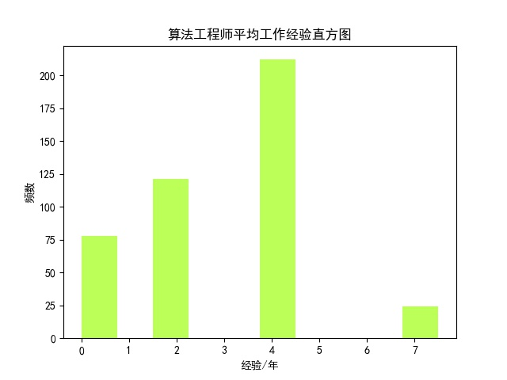
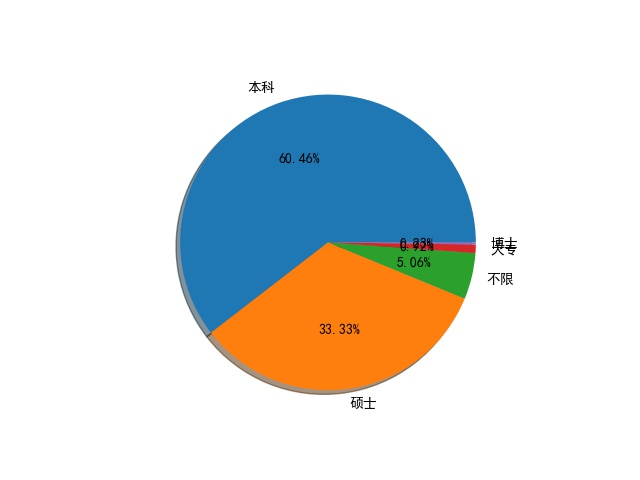
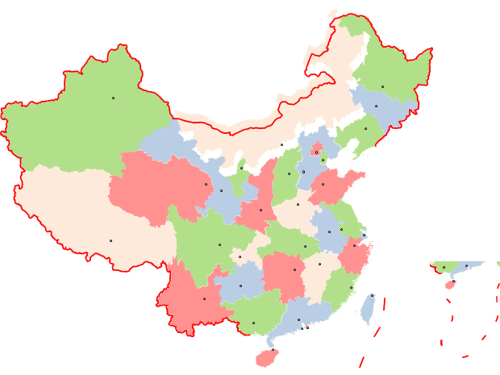

# 爬取分析拉勾网招聘信息

[TOC]

> 爱写bug（ID：icodebugs）
>
> 作者：爱写bug

#### 前言：

​	看了很多网站，只发现获取拉勾网招聘信息是只用post方式就可以得到，应当是非常简单了。推荐刚接触数据分析和爬虫的朋友试一下。

*在python3.7、acaconda3环境下运行通过*

## 数据爬取篇：

### 1、伪造浏览器访问拉勾网

打开Chrome浏览器，进入拉勾网官网，右键->检查，调出开发者模式。

然后在拉勾网搜索关键词 `算法工程师` 回车，然后点击下一页、下一页，`此时开发者工具里的Network` 下`XHR`（表示该网站是以Ajax方式获取刷新信息的）应当如下图（图中已标明了一些关键信息）：



每次点击下一页图中XHR下以`PositionAjax`开头的请求就会多一条，图下方 `Form Data` 里 page number`pn` 就会增加1，网站地址：`https://www.lagou.com/jobs/list_` + 搜索关键词 `city=` + 城市名称 +`&cl=false&fromSearch=true&labelWords=&suginput=` 

当然搜索关键词是中文的话一定要 unicode 转码。这里我们以关键字为算法工程师，地区为全国 为例，所以URL：

```
转码前：
https://www.lagou.com/jobs/list_算法工程师?city=全国&cl=false&fromSearch=true&labelWords=&suginput=
转码后：
https://www.lagou.com/jobs/list_%E7%AE%97%E6%B3%95%E5%B7%A5%E7%A8%8B%E5%B8%88?city=%E5%85%A8%E5%9B%BD&cl=false&fromSearch=true&labelWords=&suginput=
```

根据图中 `Request Headers` 构造请求头伪造成浏览器访问：

```
headers = {
        'Accept': "application/json, text/javascript, */*; q=0.01",
        'User-Agent': "Mozilla/5.0 (Windows NT 10.0; Win64; x64) AppleWebKit/537.36 (KHTML, like Gecko) Chrome/75.0.3770.100 Safari/537.36",
        'Referer': "https://www.lagou.com/jobs/list_%E7%AE%97%E6%B3%95%E5%B7%A5%E7%A8%8B%E5%B8%88?city=%E5%85%A8%E5%9B%BD&cl=false&fromSearch=true&labelWords=&suginput="
    }
```

然后根据图中 `Form Data`来构造表单，只有pn表示的当前所在页数需要不断改变，所以 `pn` 定义一个变量num表示当前页数：

```
form_data = {
        'first': 'true',
        'pn': num,
        'kd': '算法工程师'
    }
```

然后试一下：

```
request=requests.post(url,data=form_data,headers=headers)
print(request.text)
```

但是尴尬的是这个时候post请求获得的回复是：

```
{"status":false,"msg":"您操作太频繁,请稍后再访问","clientIp":"182.245.65.138","state":2402}
```

由于该网站的反爬措施，此时无论把请求头构造的多好都没用，哪怕用本地的Cookie。

所以我们采用 Seesion 对话方式：

```python
s = requests.Session()  # 创建一个session对象
s.get(url_start, headers=headers, timeout=3) # 使用session维持同一个会话
cookie = s.cookies # 使用该会话的cookie
response = s.post(url, data=form_data, headers=headers, cookies=cookie, timeout=3)
```

连接成功！

### 2、获取招聘数据

然后解析返回的 json 对象。我们先在开发者工具里把 `PositionAjax` 项的 Headers 改到 Preview 看一下Chrome帮我们格式化好的 json 内容：



出现了，我们想要的数据 在 `content -> positionResult -> result`  , 一共从0到14共15条信息，这对应了网站每页现实的信息数。而最下面还有 `totalCount: 16945`  这是搜索该关键词 `算法工程师` 下的总条目数。可以根据这个算出一共有多页的信息（16945 / 15）而不是网站上显示的只有30页。由于时间关系，本次示例只获取29页数据。本次示例只获取29页数据。

```python
def parse_page(job_json):
    job_list = job_json['content']['positionResult']['result']
    company_info = []
    for job in job_list:
        job_info = []
        job_info.append(job['companyFullName'])#公司全称
        job_info.append(job['companySize'])#规模
        job_info.append(job['financeStage'])#融资情况
        job_info.append(job['district'])#位置
        job_info.append(job['positionName'])#职位
        job_info.append(job['workYear'])#工作经验要求
        job_info.append(job['education'])#学历
        job_info.append(job['salary'])#工资
        job_info.append(job['positionAdvantage'])#福利待遇
        company_info.append(job_info)#把所有职位情况添加到网页信息page_info
    return company_info
```

我们就把每个公司的各类招聘情况存储在 `company_info` 里了。

最后把所有 `company_info` 汇总在一起：

```python
result = parse_page(job_json)
all_company += result # 所有公司招聘信息汇在一起
```

接着以CSV格式存储在本地：

```
path = 'A:\Temp\\'  # 指定csv数据存储路径
df.to_csv(path + 'lagou_algorithm_data.csv', index=False)
print('保存路径：' + path + 'lagou_algorithm_data.csv')
```

**数据图片：**




## 数据分析篇：

### 1、数据清洗：

​		我们获得的数据都是以字符串形式存储的，而且像工资（20k—30k）、工作经验（3—5年）都是以区间的形式表现出来的，应该求其平均值（工资25k，工作经验4年）。另外像工作经验 不限、应届毕业生等，我们应该把该公司要求年限 改为0。

```
pattern = '\d+'  # 正则表达式-匹配连续数字
# 统计每个公司的平均经验要求
lagou_data['平均经验'] = lagou_data['经验'].str.findall(
    pattern)  # findall查找所有['经验']下的数字字符串
avg_work_year = []
for i in lagou_data['平均经验']:
    if len(i) == 0:  # 长度为0则意为着没数字，既工作经验为不限、应届毕业生等,即没有工作经验要求
        avg_work_year.append(0)
    else:  # 匹配的是两个数值的工作经验区间 几年到几年，，
        year_list = [int(j) for j in i]  # 得到每一个数转为int型
        avg_year = sum(year_list)/2  # 求工作区间的平均值，平均年限
        avg_work_year.append(avg_year)
lagou_data['平均经验'] = avg_work_year
# 统计每个公司给出的平均工资
lagou_data['平均工资'] = lagou_data['工资'].str.findall(pattern)
avg_salary = []
for k in lagou_data['平均工资']:
    salary_list = [int(n) for n in k]
    salary = sum(salary_list)/2
    avg_salary.append(salary)
lagou_data['平均工资'] = avg_salary # 新列一项平均工资
```

存储的csv文件（你需要先存到本地才能看得到）会多两列 平均经验 和 平均工资：




### 2、数据可视化：

由于本篇为基础篇只画两个最简单的图且不做过多渲染美化，数据可视化都是一些简单的绘图，只有一个中文显示乱码问题，其他并没有什么坑，所以不做过多描述。

解决中文乱码问题：

```python
plt.rcParams['font.sans-serif'] = ['SimHei']  # 替换sans-serif字体显示中文
plt.rcParams['axes.unicode_minus'] = False  # 解决坐标轴负数的负号显示问题
```

#### 平均工资直方图：

```python
# 绘制工资频率直方图
plt.hist(lagou_data['平均工资'], alpha=0.8, color='steelblue')
plt.xlabel('工资/千元')
plt.ylabel('频数')
plt.title("算法工程师平均工资直方图")
plt.savefig(path+'lagou_algorithm_salary.jpg')  # 指定保存路径
plt.show()
```



#### 平均工作经验要求直方图（代码与上面相似，省略）：



#### 学历要求饼状图：

```python
# 绘制学历要求饼图
count = lagou_data['学历'].value_counts()
plt.pie(count, labels=count.keys(), shadow=True,autopct='%2.2f%%')
plt.savefig(path+'lagou_algorithm_education.jpg')
plt.show()
```



#### 绘制福利待遇词云：

这里要注意一下，上面设置的全局显示字体仅对`matplotlib`，有效，所以这里要指定一下字体防止中文乱码。

```python
# 绘制福利待遇词云
color_mask = imread(path+'china_map.jpg')
strs = ''
for line in lagou_data['福利']:
    strs += line  # 连接所有字符串
cut_strs = ' '.join(jieba.cut(strs))  # 使用中文分词jieba，将字符串分割成列表
word_cloud = WordCloud(font_path='C:\Windows\Fonts\微软雅黑\msyh.ttc',mask=color_mask,background_color='white').generate(cut_strs)  # 指定显示字体避免中文乱码
word_cloud.to_file(path+'lagou_algorithm_wordcloud.jpg') # 存储图片
plt.imshow(word_cloud)
plt.show()
```


这里词云背景指定为中国地图：



**公司福利词云最终效果图：**


## 总结：

​		本文面向新手，文中不可避免有一些设置不合理的问题（数据量过少、工资取平均值代表不了实际情况），但还是可以从一定程度上反映出这个岗位的待遇和工资水平。

工资绝大部分集中在 2万到3万之间真的是相当高了。不过要求也不低，在多年的工作经验要求下，依然要求硕士毕业学历的公司依然占比 33%。相信过不了多久，本科和硕士的学历要求占比就会换一下位置了。五(六)险一金是开的最多的福利待遇，算是公司准则了。现在公司都流行用弹性工作、氛围什么的精神福利来招人了么。

#### 注：

文章主要参考：

- Python Data Science Handbook（Python数据科学手册）
- [pandas API 文档](https://pandas.pydata.org/pandas-docs/stable/reference/api/pandas.read_csv.html)：https://pandas.pydata.org/pandas-docs/stable/reference/api/pandas.read_csv.html
- [可视化WordCloud](https://www.jianshu.com/p/daa54db9045d): https://www.jianshu.com/p/daa54db9045d
- [matplotlib中文乱码问题](https://www.cnblogs.com/hhh5460/p/4323985.html) ：https://www.cnblogs.com/hhh5460/p/4323985.html

网站反爬机制日新月异，所以本文有较强的时效性，无法保证您在实践时是否还可行.

所有数据、操作仅作学习交流，不会用于商业用途。